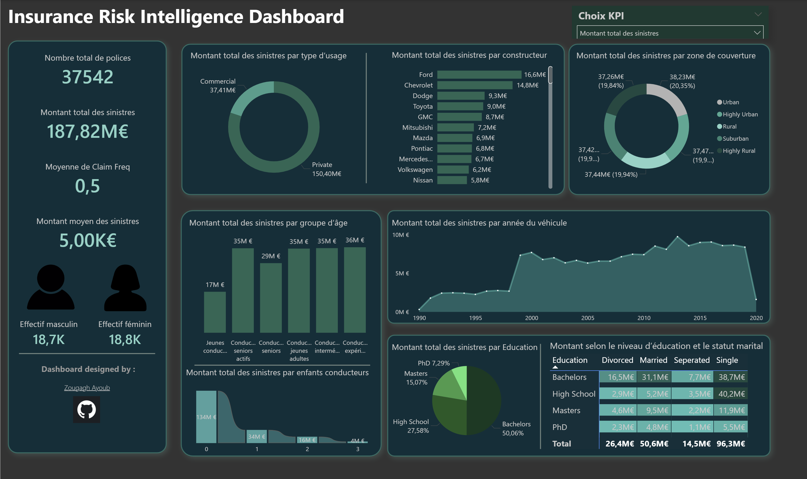

# Analyse des risques et sinistres assurance – Power BI Dashboard

##  Présentation du projet

Ce projet consiste à développer un tableau de bord interactif sous Power BI permettant d’analyser les polices d’assurance automobile et les sinistres associés.

L’objectif est d’aider une compagnie d’assurance à mieux comprendre :
- la distribution des assurés
- les comportements de sinistres
- les segments clients à risque
- l’exposition financière globale

---

##  Objectifs métier

La compagnie souhaitait centraliser les données afin de :

- Suivre le nombre total de polices actives  
- Mesurer le montant total des sinistres  
- Analyser la fréquence des sinistres  
- Évaluer le montant moyen des sinistres  
- Segmenter les clients par profil démographique  

---

##  KPI principaux

- Nombre total de polices  
- Montant total des sinistres  
- Fréquence des sinistres  
- Montant moyen des sinistres  
- Répartition par genre  

---

##  Analyses réalisées

Le dashboard inclut plusieurs visualisations :

- Analyse par usage du véhicule  
- Analyse par marque du véhicule  
- Analyse par zone de couverture  
- Analyse par groupe d’âge  
- Analyse par année du véhicule  
- Impact des enfants conducteurs  
- Analyse par niveau d’éducation  
- Croisement Éducation & Statut marital  

---

##  Outils utilisés

- Power BI  
- DAX  
- Power Query  
- Modélisation de données  

---

##  Limites

- Absence de données sur les primes (pas de calcul du Loss Ratio)
- Données académiques (non réelles)

---

##  Auteur

**Ayoub Zougagh**  
GitHub : https://github.com/zougaghayoub00-web
